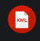

# Lenguaje de marcas UD1 

## Definiciones lenguaje de marcas.

### Definición 

Lenguaje de marcas: organiza información mediante una sintaxis basada en marcas o etiquetas.


### Tipos de lenguajes de marcas

|Tipo|Para que sirve|ejemplos|
|----|--------------|--------|
|Presentacion|muestra contenido formateado|HTML,CSS
|Descriptivo|Intercambio información|XML,Json
|Documentacion|documentar proyectos|Markdown, Latex


1. Instalar [VS Code](https://code.visualstudio.com/)
   
2. Instalar plugins
   - HTML CSS SUPPORT [LINK SUPPORT](https://marketplace.visualstudio.com/items?itemName=ms-vscode.live-server/)
   - LIVE PREVIEW [LINK SUPPORT](https://marketplace.visualstudio.com/items?itemName=ritwickdey.LiveServer/)
   - MARKDOWN ALL IN ONE [LINK SUPPORT](https://marketplace.visualstudio.com/items?itemName=yzhang.markdown-all-in-one/)
   - XML - RED HAT [LINK SUPPORT](https://marketplace.visualstudio.com/items?itemName=redhat.vscode-xml/)
  
3. Instalar git
```bash
sudo apt install git
```

4. Crear repositorio, añadir codigo y hacer commit
   ```bash


## Plugins instalados

|Plugin|Uso|Imagen|
|-|-|-|
|**HTML CSS SUPPORT**| *Facilita la escritura de código HTML y CSS mediante autocompletado y sugerencias.*||
|**LIVE PREVIEW**|*Permite ver en tiempo real cómo queda una página web mientras editas el código.*||
|**MARKDOWN ALL IN ONE**|*Proporciona herramientas para escribir y editar documentos Markdown de forma más rápida.*||
|**XML - RED HAT**|*Ofrece autocompletado, validación y herramientas para trabajar con archivos*||
